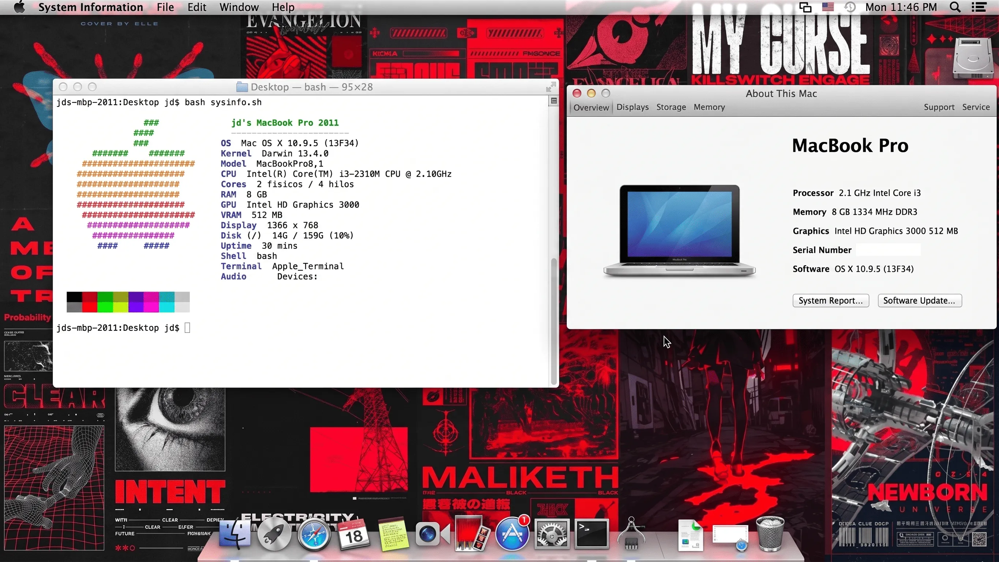

# OpenCore EFI - Positivo BGH A470

EFI para instalar y arrancar **macOS Mavericks 10.9.5** en una notebook
**Positivo BGH A470** con Intel Sandy Bridge y BIOS Legacy.



## Hardware objetivo

* Modelo: Positivo BGH A470
* CPU: Intel Core i3-2310M, Sandy Bridge
* GPU: Intel HD Graphics 3000
* RAM: 8GB DDR3 1333MHz
* Almacenamiento: HDD 160GB (2.5")
* BIOS: Legacy, sin soporte UEFI nativo
* Sistema objetivo: macOS Mavericks 10.9.5

El hardware detallado se recopila con [`scripts/detectar-hardware.sh`](scripts/detectar-hardware.sh)
y queda guardado en [`hardware-info.txt`](hardware-info.txt). El procedimiento
esta documentado en [`DETECCION-HARDWARE.md`](DETECCION-HARDWARE.md).

## Estado actual

La EFI ya logro arrancar el instalador de Mavericks, completar la instalacion,
entrar al sistema instalado y arrancar desde el disco interno sin depender del
pendrive. Teclado, trackpad y red por adaptador USB Ethernet funcionan.

Configuracion actual de arranque minimo:

* `FakeSMC.kext` activado.
* `VoodooPS2Controller.kext` y plugins PS/2 activados.
* `RealtekRTL8111.kext` v2.2.2 presente, pero desactivado en OpenCore:
  la inyeccion prelinked falla con `Invalid Parameter` en Mavericks. El puerto
  Ethernet interno sigue pendiente.
* `Lilu.kext`, `AppleALC.kext`, `ECEnabler.kext`, `WhateverGreen.kext`,
  bateria y brillo desactivados temporalmente.

El objetivo de la siguiente fase es continuar con componentes pendientes:
Ethernet interno, audio, graficos, bateria y brillo, de a un componente por vez.

## Documentacion

* [`TROUBLESHOOTING.md`](TROUBLESHOOTING.md): historial de errores, sintomas,
  causas probables, fixes aplicados y pruebas pendientes.
* [`POST-INSTALACION.md`](POST-INSTALACION.md): tareas posteriores a la
  instalacion, prioridades y checklist de componentes.
* [`DETECCION-HARDWARE.md`](DETECCION-HARDWARE.md): como ejecutar
  `scripts/detectar-hardware.sh`, que datos recopila y como traer
  `hardware-info.txt` de vuelta al repo.
* [`SSH-MAVERICKS.md`](SSH-MAVERICKS.md): como habilitar SSH en Mavericks,
  resolver compatibilidad con OpenSSH moderno y usar tunel reverso.
* [`ARRANQUE-DISCO-INTERNO.md`](ARRANQUE-DISCO-INTERNO.md): como instalar
  OpenDuet/EFI en el disco interno o repetirlo al cambiar HDD por SSD.
* [`scripts/`](scripts): scripts practicos para Mavericks. No requieren montar
  la EFI porque incluyen el kext de red necesario.

## Valores criticos

No cambiar estos valores mientras se estabiliza el arranque:

* `PlatformInfo -> Generic -> SystemProductName = MacBookPro8,1`
* `PlatformInfo -> UpdateSMBIOSMode = Create`
* `PlatformInfo -> Generic -> SpoofVendor = True`
* `PlatformInfo -> Generic -> AdviseFeatures = False`
* `Kernel -> Quirks -> CustomSMBIOSGuid = False`
* `Kernel -> Emulate -> DummyPowerManagement = True`

Esta combinacion evita que el instalador detecte la identidad real del equipo
como `POSITIVO BGH` y permite que Mavericks acepte la plataforma como
`MacBookPro8,1`.

## Privacidad

Para publicar el repo, los identificadores SMBIOS fueron reemplazados por
placeholders:

* `SystemSerialNumber = C02XXXXXXXXX`
* `MLB = C0200000000000000`
* `SystemUUID = 00000000-0000-0000-0000-000000000000`
* `ROM = 000000000000`

Antes de usar la EFI en una instalacion real, generar valores propios y no
publicarlos. La identidad critica para arrancar Mavericks es
`SystemProductName = MacBookPro8,1`; los seriales no deben reutilizarse desde
un repositorio publico.

En la practica, para un equipo viejo que no se conecta a iCloud ni a internet
con frecuencia, no hay riesgo real en usar valores fijos. A continuacion se
muestran valores de referencia compatibles con `MacBookPro8,1` que pueden
usarse directamente en una reinstalacion sin necesidad de regenerarlos:

```text
SystemProductName  = MacBookPro8,1
SystemSerialNumber = C02G7QZXDH2G
MLB                = C02024301GUH00078
SystemUUID         = 8B3C78D2-0E45-4F15-9B25-A3D5A8F6B913
ROM                = 68 17 29 AB 42 F1
```

Estos valores son un ejemplo funcional para esta maquina. Si en algun momento
se necesita conectar a servicios de Apple, conviene regenerarlos con
`GenSMBIOS` y verificar que el serial no este en uso.

## Estructura del repo

```text
.
├── boot                          ← OBLIGATORIO en Legacy. Sin este archivo
│                                    el BIOS no encuentra OpenCore.
│                                    Es un archivo regular que se puede copiar.
│                                    En disco nuevo hay que correr BootInstall.
│
├── EFI/
│   ├── BOOT/
│   │   └── BOOTx64.efi           ← Primer stage UEFI. En Legacy lo carga /boot.
│   │
│   └── OC/
│       ├── OpenCore.efi          ← Bootloader principal.
│       ├── config.plist          ← Configuracion central de OpenCore.
│       │
│       ├── ACPI/
│       │   └── MaLd0n.aml        ← SSDT todo-en-uno (Olarila).
│       │
│       ├── Drivers/
│       │   ├── HfsPlusLegacy.efi ← Lectura HFS+. Variante Legacy para
│       │   │                        Sandy Bridge (sin RDRAND).
│       │   ├── HfsPlus.efi       ← Version UEFI normal (de respaldo).
│       │   ├── OpenHfsPlus.efi   ← Alternativa open-source (de respaldo).
│       │   ├── OpenRuntime.efi   ← Runtime esencial de OpenCore.
│       │   ├── OpenCanopy.efi    ← Picker grafico (opcional).
│       │   ├── OpenUsbKbDxe.efi  ← Soporte teclado USB en pre-boot.
│       │   └── ResetNvramEntry.efi ← Opcion "Reset NVRAM" en el picker.
│       │
│       ├── Kexts/                ← Drivers de macOS inyectados por OpenCore.
│       │   ├── FakeSMC.kext          [ACTIVO]  Emulador SMC clasico (DSMOS).
│       │   ├── VoodooPS2Controller.kext [ACTIVO] Teclado + trackpad Synaptics.
│       │   │   └── PlugIns/
│       │   │       ├── VoodooPS2Keyboard.kext  [ACTIVO]
│       │   │       ├── VoodooPS2Mouse.kext     [ACTIVO]
│       │   │       └── VoodooPS2Trackpad.kext  [ACTIVO]
│       │   ├── Lilu.kext                 [desact] Framework de patches.
│       │   ├── AppleALC.kext             [desact] Audio HD.
│       │   ├── WhateverGreen.kext        [desact] GPU Intel HD 3000.
│       │   ├── ECEnabler.kext            [desact] EC/bateria.
│       │   ├── RealtekRTL8111.kext       [desact] Ethernet 10ec:8168 (v2.2.2).
│       │   ├── RealtekRTL8100.kext       [desact] Descartado (chip incorrecto).
│       │   ├── AtherosE2200Ethernet.kext [desact] No corresponde al hardware.
│       │   ├── IntelMausi.kext           [desact] No corresponde al hardware.
│       │   ├── VirtualSMC.kext           [desact] Reemplazado por FakeSMC.
│       │   ├── SMCBatteryManager.kext    [desact] Plugin VirtualSMC.
│       │   ├── SMCLightSensor.kext       [desact] Plugin VirtualSMC.
│       │   ├── SMCProcessor.kext         [desact] Plugin VirtualSMC.
│       │   ├── BrightnessKeys.kext       [desact] Requiere min 10.11.
│       │   ├── CryptexFixup.kext         [desact] Solo macOS 13+.
│       │   └── USBInjectAll.kext         [desact] Requiere min 10.11.
│       │
│       └── Resources/            ← Iconos/temas del picker (opcional).
│
├── hardware-info.txt             ← Reporte de hardware generado desde Mavericks.
├── kexts-mavericks/              ← Zips de kexts descargados (backup).
│
├── scripts/
│   ├── ssh.sh                    ← Habilita SSH en Mavericks.
│   ├── red.sh                    ← Instala kext Ethernet en S/L/E.
│   ├── ver.sh                    ← Verifica interfaces de red.
│   ├── diag.sh                   ← Diagnostico de red.
│   ├── efi-interno.sh            ← Instala EFI en disco interno/SSD.
│   ├── detectar-hardware.sh      ← Genera hardware-info.txt.
│   ├── EFI/                      ← Copia de la EFI para efi-interno.sh.
│   ├── LegacyBoot/               ← Archivos OpenDuet para boot Legacy.
│   └── kexts/                    ← Kexts para instalar en S/L/E.
│
├── POST-INSTALACION.md
├── TROUBLESHOOTING.md
├── DETECCION-HARDWARE.md
├── SSH-MAVERICKS.md
├── ARRANQUE-DISCO-INTERNO.md
└── README.md                     ← Este archivo.
```

## Arranque Legacy

La notebook no arranca OpenCore en modo UEFI puro. El pendrive o disco interno
debe tener OpenDuet instalado y conservar el archivo raiz `boot`.

Layout esperado en la particion booteable (pendrive o disco interno):

```text
/boot                       ← OBLIGATORIO. Sin este archivo no arranca.
/EFI/BOOT/BOOTx64.efi      ← Stage UEFI cargado por /boot.
/EFI/OC/OpenCore.efi        ← Bootloader principal.
/EFI/OC/config.plist        ← Configuracion.
```

### Sobre el archivo `/boot`

El archivo `/boot` es un archivo regular que **se puede copiar** como cualquier
otro. Lo que hace `BootInstall_X64.tool` son **dos cosas**:

1. Copia el archivo `boot` a la raiz de la particion.
2. Escribe codigo en los **boot sectors** (MBR/PBR) del disco que le dice al
   BIOS: "busca un archivo llamado `boot` y cargalo".

Por eso:

| Escenario | Que hacer |
|-----------|-----------|
| **Actualizar la EFI en un disco que ya arranca** | Copiar `boot` + `EFI/` alcanza. Los boot sectors ya estan. |
| **Disco o SSD nuevo (recien formateado)** | Hay que correr `BootInstall_X64.tool` o `efi-interno.sh`. Solo copiar `boot` **no alcanza** porque el disco no tiene los boot sectors configurados. |

> **IMPORTANTE**: si tenés un `boot` guardado (por ejemplo en el repo o en un
> backup), **conservalo**. En una reinstalacion sobre un disco que ya estaba
> funcionando, copiarlo junto con la carpeta `EFI/` es suficiente y no hace falta
> volver a correr `BootInstall`. Solo en un disco virgen hay que ejecutar el
> instalador de OpenDuet.

No confundir `/boot` con `/EFI/BOOT/BOOTx64.efi`: son etapas distintas del
arranque Legacy. `/boot` es el primer stage que carga el BIOS; `BOOTx64.efi`
es el segundo stage que carga OpenCore.

## Flujo de trabajo recomendado

1. Probar la EFI en modo minimo.
2. Si congela, tomar foto de la ultima linea verbose y revisar
   [`TROUBLESHOOTING.md`](TROUBLESHOOTING.md).
3. Si arranca, ejecutar [`scripts/detectar-hardware.sh`](scripts/detectar-hardware.sh) desde
   Mavericks y traer el nuevo `hardware-info.txt`.
4. Para trabajo remoto, seguir [`SSH-MAVERICKS.md`](SSH-MAVERICKS.md).
5. Para instalar en disco interno o SSD nuevo, seguir
   [`ARRANQUE-DISCO-INTERNO.md`](ARRANQUE-DISCO-INTERNO.md).
6. Seguir las prioridades de [`POST-INSTALACION.md`](POST-INSTALACION.md).
7. Reactivar kexts uno por uno y documentar cada cambio.

## Preparacion rapida del instalador

1. Crear el instalador con `Install OS X Mavericks.app`:

   ```bash
   sudo /Applications/Install\ OS\ X\ Mavericks.app/Contents/Resources/createinstallmedia --volume /Volumes/MyVolume --applicationpath /Applications/Install\ OS\ X\ Mavericks.app
   ```

2. Instalar OpenDuet/Legacy boot en el pendrive:

   ```bash
   sudo bash OpenCorePkg/Utilities/LegacyBoot/BootInstall_X64.tool /dev/diskX
   ```

3. Montar la particion EFI del pendrive y copiar la carpeta `EFI` del repo.
4. Verificar que el archivo `/boot` siga existiendo en la raiz de la particion.
5. En el instalador de Mavericks, antes de instalar, abrir Terminal y fijar una
   fecha anterior al vencimiento de certificados:

   ```bash
   date 1010101014
   ```

## Politica de cambios

No hacer `push` sin pedido explicito y sin haber probado la EFI en el equipo
real.

## Para mi futuro yo

Mavericks usa OpenSSH 6.2, que es tan viejo que las Mac modernas rechazan sus
algoritmos por defecto. Para copiar archivos desde la Mac de trabajo a
Mavericks hay que forzar compatibilidad con estas flags.

Poner lo que se quiera enviar en `~/Desktop/folder` y copiar este comando tal
cual (es una sola linea):

```
scp -O -r -o KexAlgorithms=diffie-hellman-group14-sha1 -o HostKeyAlgorithms=ssh-rsa -o PubkeyAcceptedAlgorithms=+ssh-rsa -o Ciphers=aes128-ctr -o MACs=hmac-sha1 ~/Desktop/folder jd@192.168.8.39:~/Desktop/
```

**Enviar una carpeta** (version expandida para leer mejor):

```bash
scp -O -r \
  -o KexAlgorithms=diffie-hellman-group14-sha1 \
  -o HostKeyAlgorithms=ssh-rsa \
  -o PubkeyAcceptedAlgorithms=+ssh-rsa \
  -o Ciphers=aes128-ctr \
  -o MACs=hmac-sha1 \
  ~/Desktop/folder jd@192.168.8.39:~/Desktop/
```

**Enviar un archivo suelto** (sin `-r`):

```bash
scp -O \
  -o KexAlgorithms=diffie-hellman-group14-sha1 \
  -o HostKeyAlgorithms=ssh-rsa \
  -o PubkeyAcceptedAlgorithms=+ssh-rsa \
  -o Ciphers=aes128-ctr \
  -o MACs=hmac-sha1 \
  ~/Desktop/archivo.zip jd@192.168.8.39:~/Desktop/
```

Que hace cada flag:

| Flag | Para que sirve |
|------|---------------|
| `-O` | Fuerza el protocolo SCP clasico. Sin esto, macOS moderno usa SFTP internamente y Mavericks no lo entiende. |
| `-r` | Copia recursiva (carpetas completas con su contenido). |
| `KexAlgorithms` | Usa intercambio de claves Diffie-Hellman antiguo que Mavericks soporta. |
| `HostKeyAlgorithms` | Acepta claves RSA del servidor (Mavericks no tiene Ed25519). |
| `PubkeyAcceptedAlgorithms` | Permite autenticacion con clave publica RSA. |
| `Ciphers` | Usa cifrado AES-128-CTR, compatible con OpenSSH 6.2. |
| `MACs` | Usa HMAC-SHA1 para verificar integridad, compatible con Mavericks. |
